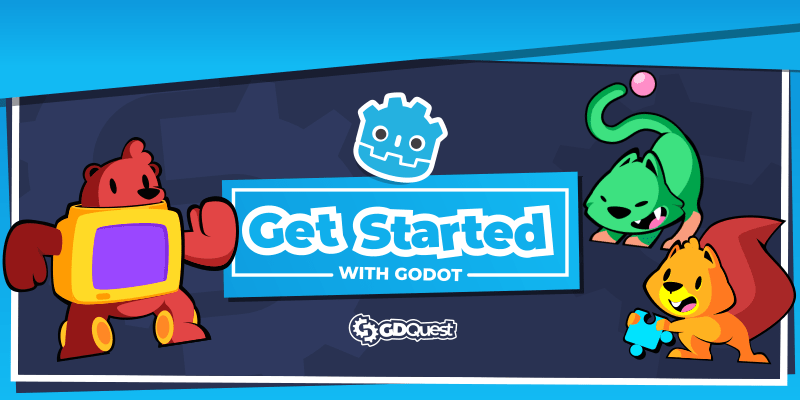

# Getting started in 2021

This repository contains copies of the Godot projects to follow along the free tutorial series [Getting started with Godot in 2021](https://www.gdquest.com/tutorial/godot/learning-paths/getting-started-in-2021/).

As it's based on the official documentation, the projects come from it, and I re-uploaded them here to provide convenient download links on relevant lessons.
